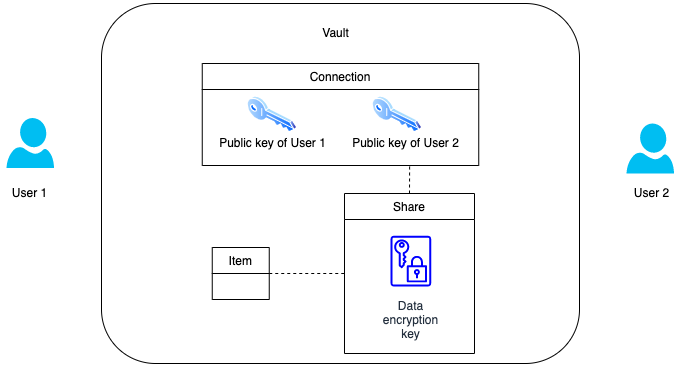
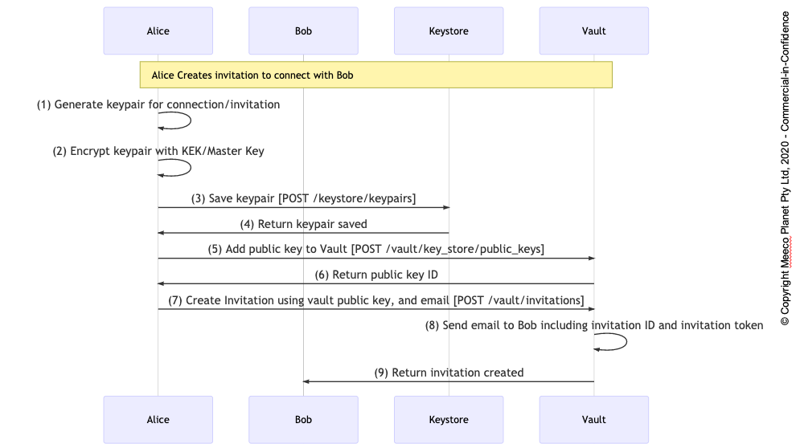
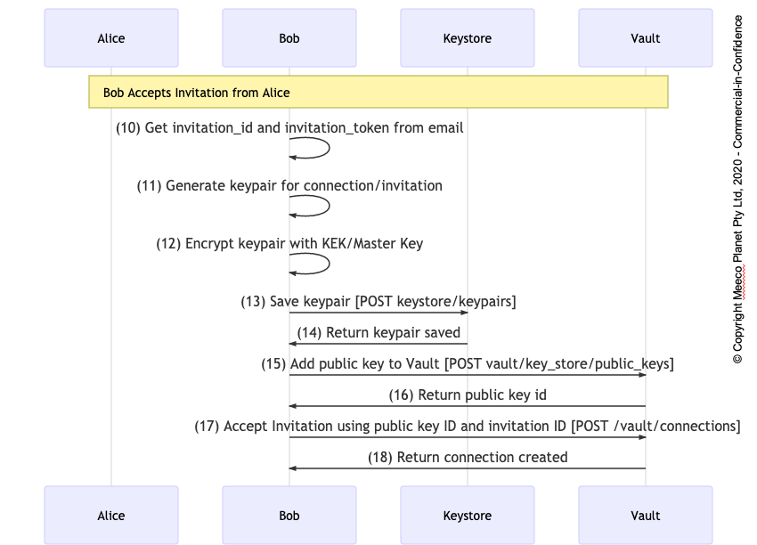
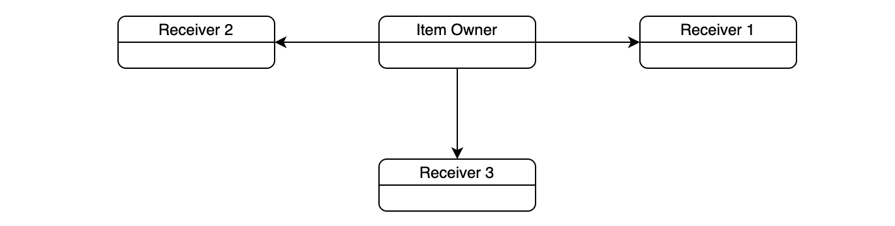
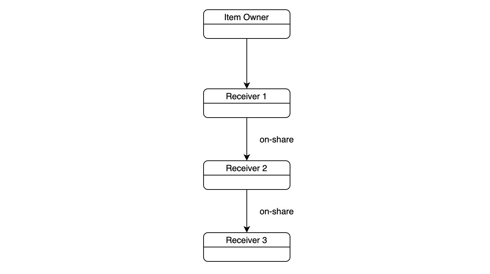
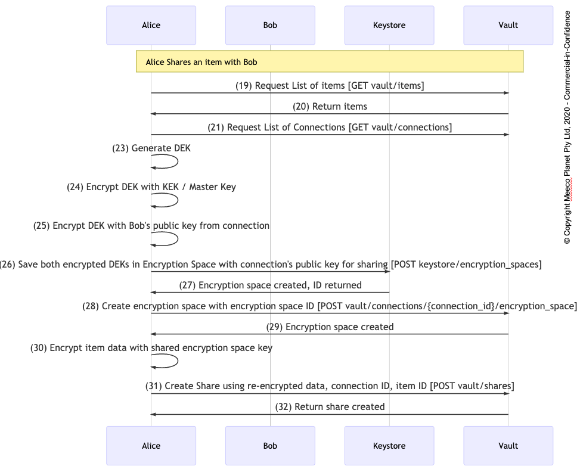
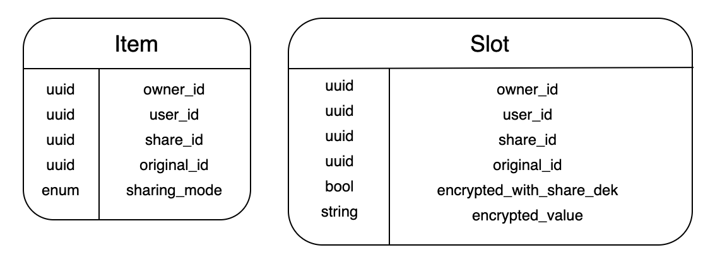
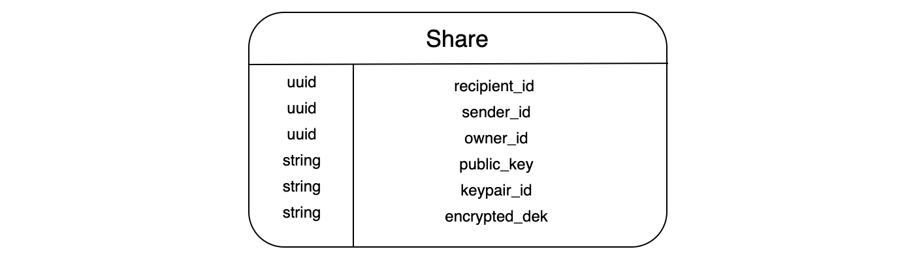
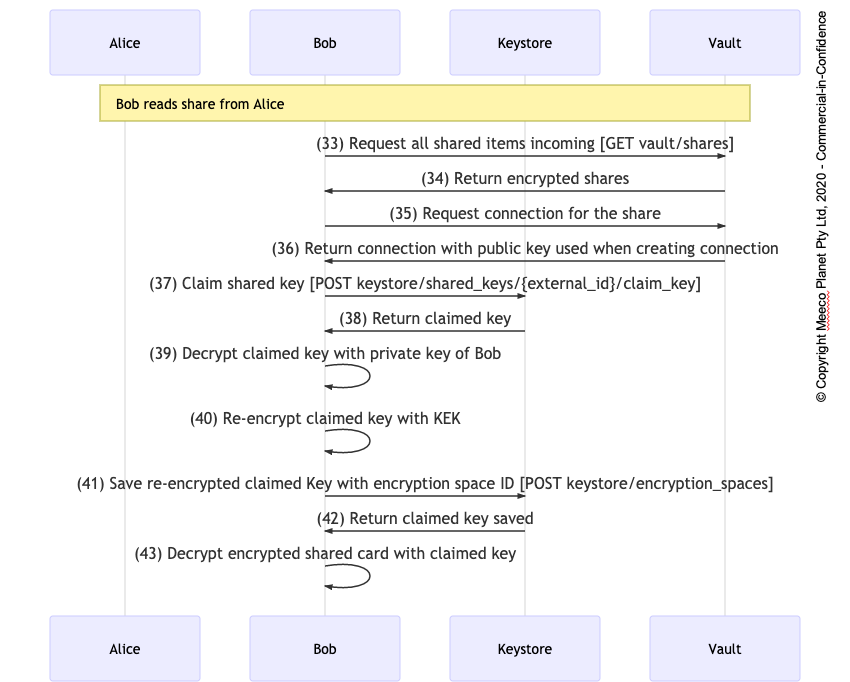

# Connections and Sharing

### A follow along guide using the Meeco CLI to build on the Quickstart Guide

_Below the guide using the CLI we have a more in depth explanation of how sharing works_

After successfully creating an item in your user's Vault from the [Quickstart section](../getting-started/quickstart.md), it's now time to create another user called Bob.

```bash
meeco users:create -p supersecretpassword > .bob.yaml
```

We used the same password as in the [Quickstart](../getting-started/quickstart.md) example, in case you were wondering.

Using the CLI again, we're going to make a connection configuration file between _Alice_ and _Bob_

```bash
meeco connections:create-config --from .alice.yaml --to .bob.yaml > .connection_config.yaml
```

This creates a file called `.connection_config.yaml` which we will open and edit the `fromName` and `toName` keys. Let's make it between Alice and Bob. Next, it's time to use the CLI again to create the connection between the two users.

```bash
meeco connections:create -c .connection_config.yaml
```

This generates the keypairs for the connection, creates and accepts the invitation for the two users.

Now, we're ready to select an item from Alice's vault and share it with Bob. 

First, we'll need to create the share template with the CLI. You can see the items Alice has by useing the `items:list` command:

```yaml
meeco items:list -a .alice.yaml
```

This will give you all the information about the items Alice has in her vault. The response will look like this:

```yaml
kind: Items
spec:
  - id: ed6ac62d-4f9e-4ec3-94f4-9bd1166942ce
    name: delorean
    label: DeLorean
    description: null
    created_at: "2020-03-25T09:31:19.959Z"
    item_template_id: 61516c6f-81df-4c86-96df-8af915f0aec0
    ordinal: 1
    visible: true
    updated_at: "2020-03-25T09:31:20.701Z"
    item_template_label: Vehicle
    shareable: false
    me: false
    background_color: null
    image: https://api-sandbox.meeco.me/images/ef8ef92e-e4be-4f50-bfce-774a608098ca
    image_background_colour: null
    item_image: https://api-sandbox.meeco.me/images/ef8ef92e-e4be-4f50-bfce-774a608098ca
    item_image_background_colour: null
    slot_image: null
    slot_image_background_colour: null
    category_image: null
    category_image_background_colour: null
    classification_node_ids: []
    category_label: null
    association_ids: []
    associations_to_ids: []
    slot_ids:
      - 00e99d0d-d1be-469c-aa91-71e9f47333b1
      - 38d6b94c-a3da-4b82-942f-5b7941e0bd7d
      - 94e422b9-b0fb-4b36-bfa9-f2234bf03d69
      - ec6c3f97-b806-4bed-9da3-46a81635c0e3
      - 2c833498-9dfa-4667-94cc-d39c719cab86
      - b583b85e-4e98-49b5-adcd-185b31cc8d90
      - bb1ff70c-6bf6-47ba-9a8a-d916740c55a6
      - f24572c4-0d7b-404d-82f5-8fec593592fc
      - 08471b2d-ac3f-44bc-8932-4faa81366178
```

Once you have have the `id` of the item, add it to the following CLI command:

```bash
meeco shares:create-config --from .alice.yaml --to .bob.yaml -i ITEM_ID_TO_SHARE > .share_config.yaml
```

After this configuration file is created, we can create the share between the two users:

```bash
meeco shares:create -c .share_config.yaml
```

The CLI sets up a _private encryption space_ between Alice and Bob and then shares the item.

We never created an item for the Bob, so we know that the following command will show the items that have been shared with Bob.

```bash
meeco shares:list -a .bob.yaml
```

The above lists all the shares between the users:

```yaml
kind: Shares
spec:
  - share_id: 1f4f9009-7a3a-43ee-b9f2-71d726919d5c
    connection_id: 8c50ec41-acf4-4441-983f-cb8d6f21743c
    item:
      id: ed6ac62d-4f9e-4ec3-94f4-9bd1166942ce
      name: delorean
      label: DeLorean
      description: null
      created_at: "2020-03-25T09:31:19.959Z"
      item_template_id: 61516c6f-81df-4c86-96df-8af915f0aec0
      ordinal: 1
      visible: true
      updated_at: "2020-03-25T09:31:20.701Z"
      item_template_label: Vehicle
      shareable: false
      me: false
      background_color: null
      image: https://api-sandbox.meeco.me/images/ef8ef92e-e4be-4f50-bfce-774a608098ca
      image_background_colour: null
      item_image: https://api-sandbox.meeco.me/images/ef8ef92e-e4be-4f50-bfce-774a608098ca
      item_image_background_colour: null
      slot_image: null
      slot_image_background_colour: null
      category_image: null
      category_image_background_colour: null
      classification_node_ids: []
      category_label: null
      association_ids: []
      associations_to_ids: []
      slot_ids:
        - 00e99d0d-d1be-469c-aa91-71e9f47333b1
        - 38d6b94c-a3da-4b82-942f-5b7941e0bd7d
        - 94e422b9-b0fb-4b36-bfa9-f2234bf03d69
        - ec6c3f97-b806-4bed-9da3-46a81635c0e3
        - 2c833498-9dfa-4667-94cc-d39c719cab86
        - b583b85e-4e98-49b5-adcd-185b31cc8d90
        - bb1ff70c-6bf6-47ba-9a8a-d916740c55a6
        - f24572c4-0d7b-404d-82f5-8fec593592fc
        - 08471b2d-ac3f-44bc-8932-4faa81366178
```

We can then grab the `share_id` and use it in the next call:

```yaml
meeco shares:get -a .bob.yaml SHARE_ID
```

Here's the shared DeLorean:

```yaml
kind: Item
spec:
  id: ed6ac62d-4f9e-4ec3-94f4-9bd1166942ce
  name: delorean
  label: DeLorean
  description: null
  created_at: "2020-03-25T09:31:19.959Z"
  item_template_id: 61516c6f-81df-4c86-96df-8af915f0aec0
  ordinal: 1
  visible: true
  updated_at: "2020-03-25T09:31:20.701Z"
  item_template_label: Vehicle
  shareable: false
  me: false
  background_color: null
  image: https://api-sandbox.meeco.me/images/ef8ef92e-e4be-4f50-bfce-774a608098ca
  image_background_colour: null
  item_image: https://api-sandbox.meeco.me/images/ef8ef92e-e4be-4f50-bfce-774a608098ca
  item_image_background_colour: null
  slot_image: null
  slot_image_background_colour: null
  category_image: null
  category_image_background_colour: null
  classification_node_ids: []
  category_label: null
  association_ids: []
  associations_to_ids: []
  slot_ids:
    - 00e99d0d-d1be-469c-aa91-71e9f47333b1
    - 38d6b94c-a3da-4b82-942f-5b7941e0bd7d
    - 94e422b9-b0fb-4b36-bfa9-f2234bf03d69
    - ec6c3f97-b806-4bed-9da3-46a81635c0e3
    - 2c833498-9dfa-4667-94cc-d39c719cab86
    - b583b85e-4e98-49b5-adcd-185b31cc8d90
    - bb1ff70c-6bf6-47ba-9a8a-d916740c55a6
    - f24572c4-0d7b-404d-82f5-8fec593592fc
    - 08471b2d-ac3f-44bc-8932-4faa81366178
  slots:
    - id: 00e99d0d-d1be-469c-aa91-71e9f47333b1
      name: power
      created_at: "2020-03-25T09:31:20.679Z"
      updated_at: "2020-03-25T09:31:20.679Z"
      value: 132 PS
      label: Power
      encrypted_value: Aes256Gcm.QAYRmdDe.LS0tCml2OiAhYmluYXJ5IHwtCiAgTzhXa0pQdFE5R1haNURUcQphdDogIWJpbmFyeSB8LQogIFhSaUJYVmtWVW93ak1DTGUyTFRPRHc9PQphZDogbm9uZQo=
    - id: 38d6b94c-a3da-4b82-942f-5b7941e0bd7d
      name: model_make
      created_at: "2020-03-25T09:31:20.174Z"
      updated_at: "2020-03-25T09:31:20.660Z"
      value: DMC DeLorean
      label: Make or model
      encrypted_value: Aes256Gcm.XYQwMPJurLuPIDHR.LS0tCml2OiAhYmluYXJ5IHwtCiAgc3E1RXJIZVN3TVRkUTFrOAphdDogIWJpbmFyeSB8LQogIDlrWGhSQWhIbVdjdUNVemY1NDlIRlE9PQphZDogbm9uZQo=
    - id: 94e422b9-b0fb-4b36-bfa9-f2234bf03d69
      name: licence_plate
      created_at: "2020-03-25T09:31:20.017Z"
      updated_at: "2020-03-25T09:31:20.633Z"
      value: 1AAA999
      label: Vehicle registration number
      encrypted_value: Aes256Gcm.HIcPWNbEaA==.LS0tCml2OiAhYmluYXJ5IHwtCiAgdzcyM09PWnJZTGtITi9DRQphdDogIWJpbmFyeSB8LQogIDVEZVNxRWRoNitURkVMZmRCVWV4a2c9PQphZDogbm9uZQo=
    - id: ec6c3f97-b806-4bed-9da3-46a81635c0e3
      name: vin
      created_at: "2020-03-25T09:31:20.085Z"
      updated_at: "2020-03-25T09:31:20.604Z"
      value: "123456789"
      label: VIN
      encrypted_value: Aes256Gcm.qEdyalKPXS75.LS0tCml2OiAhYmluYXJ5IHwtCiAgQzBIUDhCdGh6SStKZC9OdQphdDogIWJpbmFyeSB8LQogIGlqS1lPNDlQOTVXemJHQ0NNcGZjWlE9PQphZDogbm9uZQo=
    - id: 2c833498-9dfa-4667-94cc-d39c719cab86
      name: image
      created_at: "2020-03-25T09:31:20.382Z"
      updated_at: "2020-03-25T09:31:20.382Z"
      value: null
      label: Image
      encrypted_value: null
    - id: b583b85e-4e98-49b5-adcd-185b31cc8d90
      name: tags
      created_at: "2020-03-25T09:31:20.332Z"
      updated_at: "2020-03-25T09:31:20.332Z"
      value: null
      label: Tags
      encrypted_value: null
    - id: bb1ff70c-6bf6-47ba-9a8a-d916740c55a6
      name: story_category
      created_at: "2020-03-25T09:31:20.297Z"
      updated_at: "2020-03-25T09:31:20.297Z"
      value: null
      label: Category
      encrypted_value: null
    - id: f24572c4-0d7b-404d-82f5-8fec593592fc
      name: type
      created_at: "2020-03-25T09:31:20.218Z"
      updated_at: "2020-03-25T09:31:20.576Z"
      value: Sports Car
      label: Type
      encrypted_value: Aes256Gcm.hS5iJt0KvmoJhA==.LS0tCml2OiAhYmluYXJ5IHwtCiAgOEVlejhVQy9WRUxjd0g5MwphdDogIWJpbmFyeSB8LQogIDZrYk5Gb3hkSFhGNlNHNnhHV1V3a0E9PQphZDogbm9uZQo=
    - id: 08471b2d-ac3f-44bc-8932-4faa81366178
      name: purchase_date
      created_at: "2020-03-25T09:31:20.131Z"
      updated_at: "2020-03-25T09:31:20.547Z"
      value: 01/01/1981
      label: Date purchased
      encrypted_value: Aes256Gcm.te5KGY2qJ2pIRw==.LS0tCml2OiAhYmluYXJ5IHwtCiAgc1Nqd0NZb1dEUlM3b2JQNQphdDogIWJpbmFyeSB8LQogIG5PRGhQVmtFVDZLeStEZnRLOHZ3NGc9PQphZDogbm9uZQo=

Fetching connection... done
```

Well done - you've now created a connection between two users, and shared an item!

## Sharing Cards Between Users - In Depth

All user data stored in the Vault is encrypted and can only be decrypted and read by the user.

Howerver, the Meeco platform makes it possible for one user to share cards with another user. We will cover this process and its steps in this guide.

In summary, the sharer will generate a DEK \(data encryption key\) specifically for the purpose of this share and re-encrypt the shared card with this key. In order to share the DEK, Public Key cryptography is used: the sharer will encrypt the DEK with a Public Key of the share recipient, so only the share recipient can decrypt the DEK with their Private Key, and then use the DEK to decrypt the card.



Let's dive into it.

### Invitation To Connect

Before anything can be shared, 2 Users need to establish a _**connection**_. In order to create a connection in this example, User 1 \(Alice\) will invite User 2 \(Bob\)

The process can be described in the following sequence diagram:



At step \(1\) User 1 generates a Keypair which will be used for inviting another user, and later for the key exchange.

Steps 2-4 are part of the standard procedure used for storing Keypairs in the Keystore. If there is a Keypair, it is encrypted by the Key Encryption Key \(KEK\) and stored in the Keystore. Please read guide [Setting Up Access to the Vault and Keystore](setting-up-access.md) if you haven't read it yet.

In steps 5 and 6,

 stores the Public Key. In steps 7-9 User 1 creates an invitation using the following as input:

* email of the user that User 1 wants to connect to \(User 2\)
* the ID of the Public Key stored in step 5

In step 8 the Vault sends an invitation email to User 2.

### Accepting Invitation

In this section we'll describe the scenario when User 2 accepts the invitation from User 1.

This process can be described in the following sequence diagram:



Most of these steps are the the same steps of User 1 in the previous section: just like User 1, User 2 generates a Keypair for this connection \(step 11\), encrypts it and stores in the Keystore \(steps 12-14\), and publishes the Public Key in the Vault \(steps 15-16\).

The most important step is a call to create a connection as step 12. The parameters of the call are the invitation ID and the invitation token.

The most important results after these two sections are as follows:

* The connection between User 1 and User 2 has now been established
* User 1 has access to the Public Key of User 2 via the connection record
* User 2 has access to the Public Key of User 1 via the connection record

### Differenciating Sharing and Ownership

Sharing and Ownership are concepts that co-exist but are very different when compared to each other. Traditionally, shares exist like below: 
<p align="center">

</p>

However, with version 2.0, there is a concept of on-sharing. This means that a shared item can be further shared with other users if the option is enabled for the item. The sharing diagram will now look something like below: 

<p align="center">

</p>

The item's owner remains constant, however, the item can be re-shared by a former receipient. 
There are two different aspects of a share: 

- The act of creating a share is a relation between the owner and the receipient.
- Each share is a relation between the receipient and the owner of the item.

Therefore, each share has three fields pointing to 3 users: 

- ```receipient_id```: the receipient of the share
- ```sender_id```: the sender of the share
- ```owner_id```: the original owner of the item

The owner_id and the sender_id might refer to the same user if its the first time the item is being shared.

### How Shared Data Is Stored

Every time an item is shared, it creates a duplicate of the original slots and item. These duplicate values are stored directly in the duplicate record rather than the share record.


### Creating A Share

In this section, to create a share, User 1 will generate a DEK dedicated to this share, re-encrypt a card and store it as a share, and share the DEK with User2, encrypted by the Public Key of User 2.

There are 3 new fields added to slots and items that are utilised within the share: 

- ```owner_id``` : points to the owner of the slot/item. For your own slots/items owner_id is the same as user_id
- ```share_id``` : for your own slots/items share_id is NULL
- ```original_id``` : points to the original slot/item record
- ```encrypted_with_share_dek``` : Once a shared duplicate record is created, it is encrypted with a share DEK and encrypted_with_share_dek is set to false. The client is expected to re-encrypt the slot value with his/her private DEK.
Re-encrypting the slot value is the only modification the recipient may do, it is not possible to delete or add slots, or modify fields other than encrypted_value. The process of encryption is described below: 

The process of encryption and the key exchange is abstracted into something called _Encryption Space_. An encryption space exists both in the _**Keystore**_ and the _**Vault**_ and both records share the same ID. The function of the encryption space in the _**Keystore**_ is key exchange. The function of the encryption space in the _**Vault**_ is a way to point to the correct encryption space in the _**Keystore**_ for a given connection.

Creation of a share can be described in the following sequence diagram:



At step 23 User 1 generates a DEK. This DEK will be used to encrypt the shared card. As we always do with DEKs, we encrypt it the Key Encryption Key \(step24\). But we also need to have the key readable by User 2, so at step 25 we encrypt the same KEK by the Public Key of User 2.

At steps 26 and 27 an encryption space is created in the _**Keystore**_, containing two versions of the same DEK, one only readable by User 1, the other one only readable by User 2.

In steps 28-29 an encryption space is created in the Vault with the same ID as the encryption space in the Keystore. The encryption space in the Vault is linked to the connection record.

In steps 30-31 User 1 encrypts the card data with the shared DEK and creates a Share record.

The main results of these steps are as follows:

* A DEK has been created waiting to be claimed by User 2
* This DEK is wrapped in an Encryption Space
* A Share record has been created in the Vault, and it is linked to the connection between User 1 and User 2
* An Encryption Space in the Vault is a link between the connection and the Encryption Space in the Keystore

The item and slots are created as below:
<p align="center">
  
</p>


#### Creating a Share as Item Owner

**Scenario** : User Mary will share an item with User John

Mary will share her item to John

1. Mary has a connection to John
2. Mary retrieves John's public key and the ID of the keypair from the connection
3. Mary generates a DEK
4. Mary encrypts the DEK with the public key
5. Mary encrypts values of all slots of the items with the DEK
6. Mary executes a POST request to create a new share and submits the following:
    - John's ID
    - ID of the item
    - Encrypted values  for all slots
    - John's public key
    - The ID of the keypair
7. The backend creates a share with the following data:
    - Recipient_id is John
    - Sender_id is Mary
    - Owner_id is Mary
    - Public_key is set to John's public key
    - Keypair_external_id is set to the  keypair of John
    - Encrypted_dek is set to the DEK
8. The backend creates an item with the following data:
    - Owner_id is Mary
    - User_id is John
    - Share_id point to the share in step 7
    - Original_id points to Mary's item
9. The backend creates slots with the following data:
    - Owner_id is Mary
    - User_id is John
    - Share_id points to the share in step 7
    - Original_id points to the corresponding slot of Mary's item
    - Encrypted_with_share_dek is true
    - Encrypted_value is the encrypted value of the slot from the request
10. John reads the share, the item, and the slots
11. John retrieves the keypair by keypair_external_id from the Keystore
12. John decrypts the DEK in the share with the private key
13. John decrypts values of all slots with the DEK
14. John encrypts all values of all slots with his private DEK
15. John executes a POST request to re-encrypt the share  and submits the following:
    - The ID of the item
    - Values of all slots encrypted with John's private DEK
16. The backend replaces all slot values with the ones from the request
17. The backend sets encrypted_with_share_dek to false in all slots
18. The backend sets encrypted_dek in the share to NULL

#### Creating a Share as an Item Receipient (On-Share)

**Scenario** John is sharing Mary's item to Peter

1. Mary has a connection to John
2. There is a share of Mary's item from Mary to John
3. Mary has no connection to Peter
4. John has a connection to Peter
5. John retrieves Peter's public key and the ID of the keypair from the connection
6. John generates a DEK
7. John encrypts the DEK with the public key
8. John reads the duplicate slot records (user_id=John, owner_id=Mary) and encrypts values of all slots  with the DEK
9. John executes a POST request to create a new share and submits the following:
    - Peter's ID
    - ID of the John's duplicate item (user_id=John, owner_id=Mary)
    - Encrypted values  for all slots
    - Peter's public key
    - The ID of the keypair
10. The backend creates a share with the following data:
    - Recipient_id is Peter
    - Sender_id is John
    - Owner_id is Mary
    - Public_key is set to Peter's public key
    - Keypair_external_id is set to the  keypair of Peter
    - Encrypted_dek is set to the DEK
11. The backend creates an item with the following data:
    - Owner_id is Mary
    - User_id is Peter
    - Share_id point to the share in step 10
    - Original_id set to Mary's item's id 
12. The backend creates slots with the following data:
    - Owner_id is Mary
    - User_id is Peter
    - Share_id points to the share in step 10
    - Original_id points to the corresponding slot of Mary's item
    - Encrypted_with_share_dek is true
    - Encrypted_value is the encrypted value of the slot from the request
13. Peter reads the share, the item, and the slots
14. Peter retrieves the keypair by keypair_external_id from the Keystore
15. Peter decrypts the DEK in the share with the private key
16. Peter decrypts values of all slots with the DEK
17. Peter encrypts all values of all slots with his private DEK
18. Peter executes a POST request to re-encrypt the share  and submits the following:
    - The ID of the item
    - Values of all slots encrypted with John's private DEK
19. The backend replaces all slot values with the ones from the request
20. The backend sets encrypted_with_share_dek to false in all slots
21. The backend sets encrypted_dek in the share to NULL

### Key and Data Exchange

Key and data exchange are simplistic and depend less on the Keystore. Let's first look at how this is done now:

Shares depend on connection records which contain references to keys in the keystore

A connection has a share reader and a share writer

encryption_space_id in a connection points to a DEK in the keystore. This DEK is used for encrypting slots when sharing from share writer to share reader

public_key is the public key of the share reader

key_store_id in the connection record (also named key_store_keypair_id in the serializer) point to the private key of the above public_key

The share record doesn't use the connection DEK anymore to encrypt share data, instead it uses a one-time-use DEK which is generated each time a share is created/updated. These DEKs will be encrypted by the public key of the share recipient, and they will be stored directly in share records. Once the recipient has re-encrypted the slot value with his/her own DEK, this throwaway DEK can be removed from the share record.

The final share will have the following fields once created:

<p align="center">

</p>

### Accepting the Share

When an item is shared, the owner could demand an acceptance of the terms of share from the receipient. 
The share recipient will only have access to the shared data after the recipient accepts the terms.

This can be implemented using a custom slot containing a text field with the terms and a state field with the following ENUM

- acceptance_not_required (default)
- acceptance_required
- accepted
- rejected

When a share with state acceptance_required is created, a share record is created, all duplicate slot and item records are created, too, but the backend will not reveal the share DEK until the share is accepted.

### Updating The Share

Imagine Mary's item has changed. We need to update all shares including those where recipients are not connected with Mary. Mary requests data to update all shares of her item

1. The backend sends a list of 2-element tuples where each tuple contains:
    -  (a) a share ID 
    -  (b) a public key
2. Mary generates a DEK
3. Mary encrypts all slot values by the DEK
4. For each public key Mary encrypts the DEK with the public key
5. Mary sends back:
    -  A list of 2-element tuples where each tuple contains:
        - (a) a share ID 
        - (b) DEK encrypted with the public key of this share
    - A list of 2-element tuples where each tuple contains:
        - (a) a slot ID 
        - (b) slot value encrypted by the DEK
6. The backend sets encrypted_dek in all shares to the corresponding encrypted DEK
7. The backend sets encrypted_with_share_dek of all slots to true

The process of re-encrypting slots with private DEKs of users is always the same and has already been described above.


### Reading The Share

Reading of the share can be described in the following sequence diagram:



First in step 33 User 2 retrieves a list of all incoming shares. Each share has a connection ID.

If there is a new share User 2 needs to decrypt and read, in step 35 User 2 requests the connection for the share.

Once the ID of the encryption space is known, User 2 retrieves the DEK in steps 37-38, decrypts it with their Private Key in step 39 and decrypts the share in step 43.

As it is always done with keys, this DEK is encrypted with the Key Encryption Key \(KEK\) of User 2 and stored in the Keystore in steps 40-42
