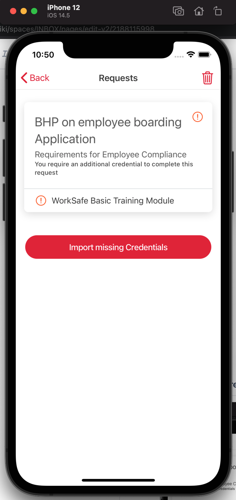
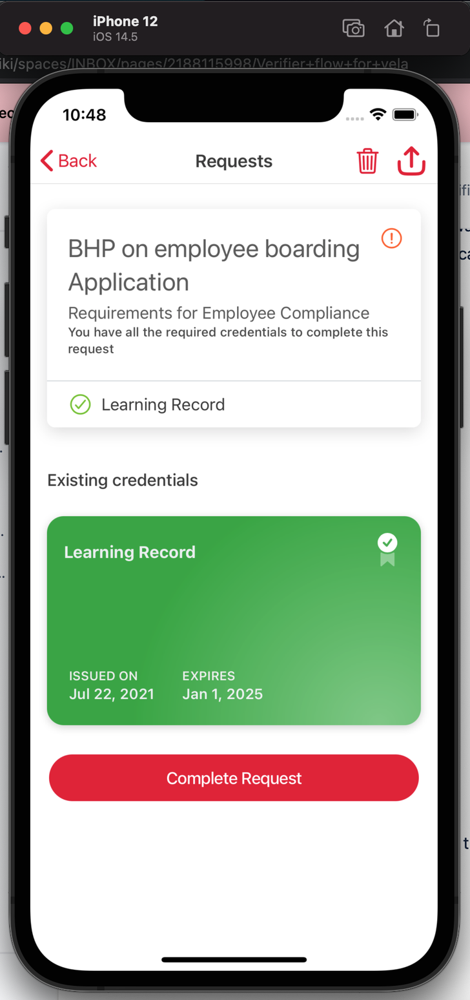
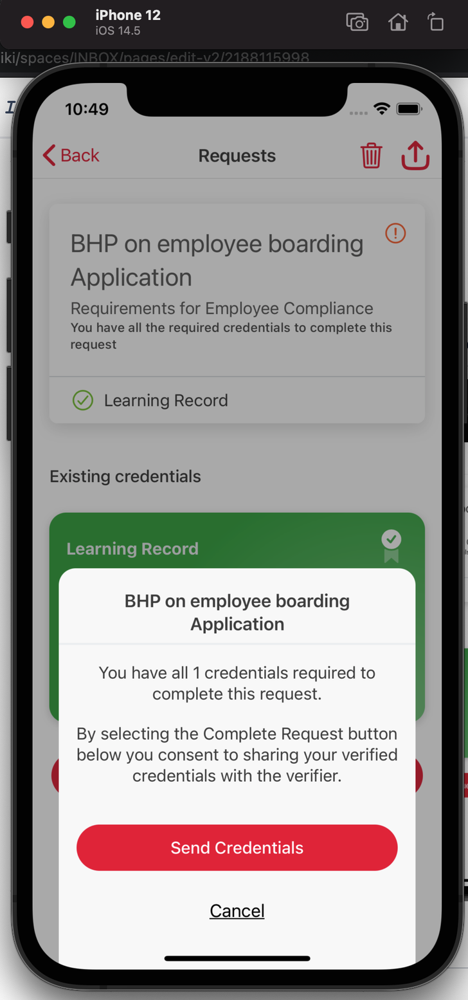

NOTE: All calls to Exchange APIs will need the header `Meeco-Subscription-Key`, this should have already been provided, please reach out to Meeco if there are any issues.\
EXCHANGE_BASE_URL = <https://sandbox.meeco.me/exchange>

# Overview

For the initial implementation, Meeco recommends calling its Exchange API endpoints in your application's back end to verify presentations provided by the wallet. In order for the Exchange to be able to verify a presentation though it must first be aware of the required structure of the presentation or "Presentation Definition". Steps 1 & 2 detail these interactions that need to take place before you start adding your application endpoints.

Your application must then have two endpoints for the Meeco Wallet to interact with based on the concept of a "Request". The request should have an associated "Presentation Definition" which your application should return, different requests may have the same or different presentation definitions, see Step 3 for more information on this. The second endpoint your application must have is an endpoint for the wallet to send the presentation (which meets the presentation definition), think of this as the "fulfillment" of the request. This second endpoint must accept the presentation, confirm its validity by checking it with the exchange API's "verify" endpoint then carry on with whatever business logic your application requires, see Step 4.

Two URLs pointing to these endpoints are packaged into an application deep-link to be provided to the wallet, see Step 5.

# Detailed instructions

### STEP 1: Create a definition using the Meeco exchange API

Request

`POST​ {EXCHANGE_BASE_URL}/presentations​/definitions`

Body

```json
{
  "name": "ABC ORG on employee boarding Application",
  "purpose": "Requirements for Employee Compliance",
  "input_descriptors": [
    {
      "id": "LearningRecordCredential",
      "name": "WorkSafe Basic Training Module",
      "purpose": "We can only allow compliant employees into the ABC ORG sites",
      "schema": [
        {
          "uri": "https://vc-schemas.meeco.me/credentials/learningRecord/1.0/schema.json"
        }
      ],
      "group": ["A"]
    }
  ],
  "format": {
    "jwt": {
      "alg": ["ES256", "RS256"]
    }
  },
  "submission_requirements": [
    {
      "name": "satisfy all inputs",
      "rule": "all",
      "from": "A"
    }
  ]
}
```

expect 201 response

```json
{
  "presentation_definition": {
    "id": "dbe5a9bc-add8-4bf6-86ed-98eaf0f6e180",
    "name": "ABC ORG on employee boarding Application",
    "purpose": "Requirements for Employee Compliance",
    "input_descriptors": [
      {
        "id": "LearningRecordCredential",
        "name": "WorkSafe Basic Training Module",
        "purpose": "We can only allow compliant employees into the ABC ORG sites",
        "schema": [
          {
            "uri": "https://vc-schemas.meeco.me/credentials/learningRecord/1.0/schema.json"
          }
        ],
        "group": ["A"]
      }
    ],
    "format": {
      "jwt": {
        "alg": ["ES256", "RS256"]
      }
    },
    "submission_requirements": [
      {
        "name": "satisfy all inputs",
        "rule": "all",
        "from": "A"
      }
    ]
  }
}
```

### STEP 2: Retrieve created definition by id & make sure its present in the Meeco exchange

GET request

`GET {EXCHANGE_BASE_URL}/presentations/definitions/dbe5a9bc-add8-4bf6-86ed-98eaf0f6e180`

expect 200 responses with the above-created definition.

### STEP 3: create the definition endpoint in your verifier application - to serve the definition from, it should return the definition from step 2

This endpoint will be used to server Verifiable Presentation Definitions to Wallet later.

GET Request

RequestId must be unique for each request

`https://{{yourAppBaseurl}}/requests/{{requestId}}/definition`

NOTE: this above URL is just a suggested URL structure, your actual URL can be different

This endpoint should return the definition from step 2.

### STEP 4: Create the destination endpoint in your verifier application - to receive the verifiable presentation in JSON-LD format - when the presentation is received verify with Meeco exchange API `POST` `/presentations/verify` endpoint

This endpoint will be used to receive Verifiable Presentation in JSON-LD format from Wallet later.

POST Request

`https://{{yourAppBaseurl}}/requests/{{requestId}}/presentations`\
NOTE: this above URL is just a suggested URL structure, your actual URL can be different

Accepts JSON in body

```json
{
  "proof": {
    "type": "Ed25519Signature2018",
    "proofPurpose": "assertionMethod",
    "created": "2021-07-23T00:17:33.000Z",
    "verificationMethod": "did:hedera:testnet:4G5VDMU2BuWC2EdAWHWuFnFxUHeypSSqqi3C9UpPfHu4;hedera:testnet:fid=0.0.78464",
    "jws": "UHoShDKrqLClpsbdMe3Dj6Mxt7u0_MqrI7b1m-qdaAQ3Nbe876ou0t6_a782i6qEMElveUoEYBTMWoNnJ9McAg"
  },
  "verifiableCredential": [
    {
      "proof": {
        "type": "Ed25519Signature2018",
        "proofPurpose": "assertionMethod",
        "created": "2021-07-23T00:13:45.000Z",
        "verificationMethod": "did:hedera:testnet:8XMRRQUsABNEFfNnS8FBo1fHARo2tBB9HYQxBRkGVk8y;hedera:testnet:fid=0.0.78464#did-root-key",
        "jws": "h7g383DMjEFtio9ILpFsF2F9bKcg010HruS61IFQ78YBcjm-eFj17N_6XYIiSqQhb1tHYLEMsefwmw7qdY4OBQ"
      },
      "@context": [
        "https://vc-schemas.meeco.me/credentials/learningRecord/1.0/context.json",
        "https://www.w3.org/2018/credentials/v1"
      ],
      "type": ["VerifiableCredential"],
      "issuer": {
        "id": "did:hedera:testnet:8XMRRQUsABNEFfNnS8FBo1fHARo2tBB9HYQxBRkGVk8y;hedera:testnet:fid=0.0.78464"
      },
      "credentialSubject": {
        "completionDate": "2021-01-02",
        "course": {
          "courseCode": "ws101",
          "id": "122345",
          "name": "WorkSafe Basic Training Module",
          "provider": "WorkPro Training",
          "version": "1.1"
        },
        "grade": "95",
        "status": "compliant",
        "type": "LearningRecordCredential",
        "id": "did:hedera:testnet:4G5VDMU2BuWC2EdAWHWuFnFxUHeypSSqqi3C9UpPfHu4;hedera:testnet:fid=0.0.78464"
      },
      "issuanceDate": "2021-07-23T00:13:45.000Z",
      "id": "urn:uuid:7b28fdde-9bab-4400-8a95-e5b49b1f9c24",
      "expirationDate": "2025-01-01T00:00:00.000Z",
      "credentialSchema": {
        "id": "https://vc-schemas.meeco.me/credentials/learningRecord/1.0/schema.json",
        "type": "JsonSchemaValidator2018"
      }
    }
  ],
  "holder": "did:hedera:testnet:4G5VDMU2BuWC2EdAWHWuFnFxUHeypSSqqi3C9UpPfHu4;hedera:testnet:fid=0.0.78464",
  "type": ["VerifiablePresentation"],
  "@context": ["https://www.w3.org/2018/credentials/v1"],
  "issuanceDate": "2021-07-23T00:17:33.000Z",
  "presentation_submission": {
    "id": "ffdc8dd1-69f9-46df-a731-d475eac1e9b4",
    "definition_id": "45a1425c-ec0f-484d-b0fc-eaf8d38e81fb",
    "descriptor_map": [
      {
        "id": "LearningRecordCredential",
        "path": "$.verifiableCredential[0]",
        "format": "ldp_vc"
      }
    ]
  }
}
```

Verify the above presentation using exchange API `POST` `/presentations/verify` by submitting the above JSON Body.

### STEP 5: Put definition and destination endpoint URLs into a wallet deep link with URL parameters (URL escaped) (can be turned into a QR code for the wallet to scan, but also can be anchor deep link when visiting the page on mobile)

`meecowallet://request?destination=http%3A%2F%2Flocalhost%3A3002%2Frequests%2F012ba582-e5a1-4245-b16b-5664e44911c8%2Fpresentations&definition=http%3A%2F%2Flocalhost%3A3002%2Frequests%2F012ba582-e5a1-4245-b16b-5664e44911c8%2Fdefinition`

QueryParams detail

definition = A URL for the wallet to request the Verifiable Presentation Definitions

destination = A URL for the wallet to post its Verifiable Presentation

Wallet creates a request once the above deep link URL is clicked on the mobile phone or QR code is scanned. e.g.


if the wallet has all the required credentials then it lets the user submit the request to the verify

 


Note: Importing Credential flow Is not available for now. So make sure LearningCredentials are already issued for Wallet or Push new LearningCredentials to the wallet before starting the presentation request flow.
