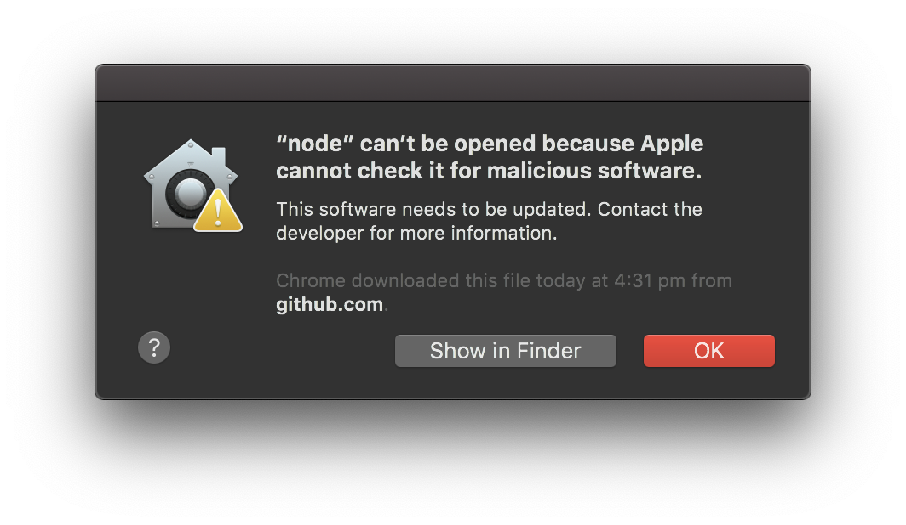
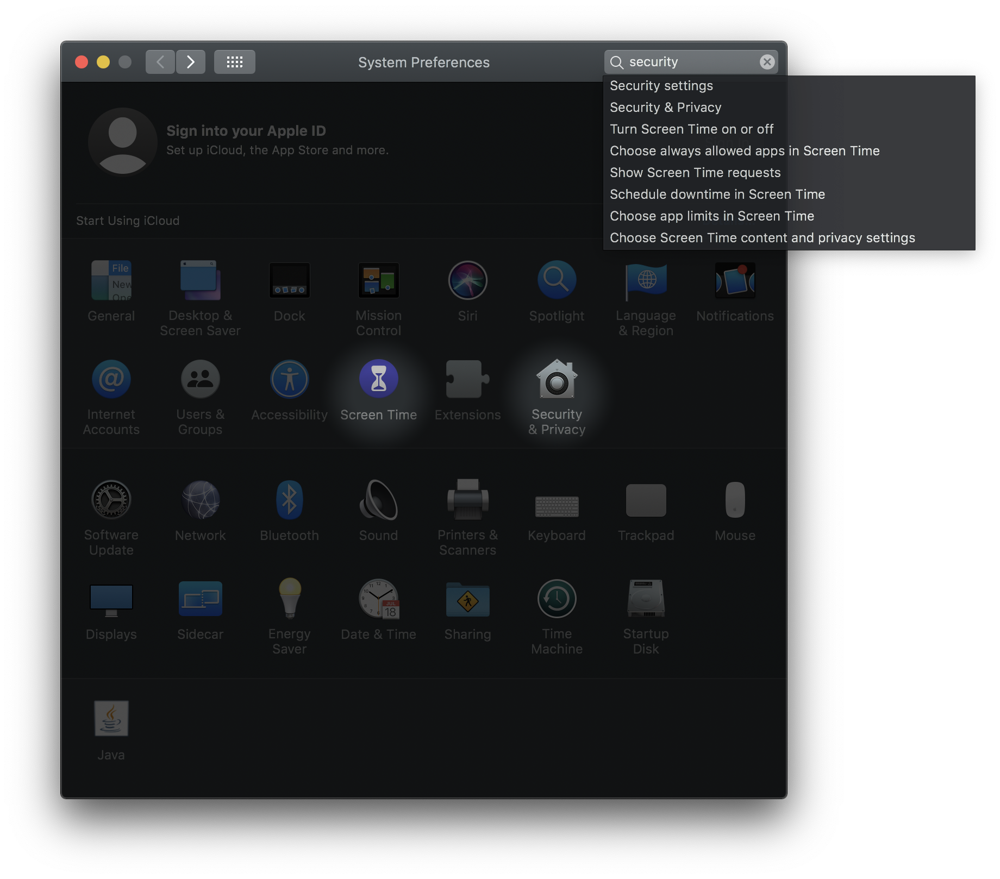
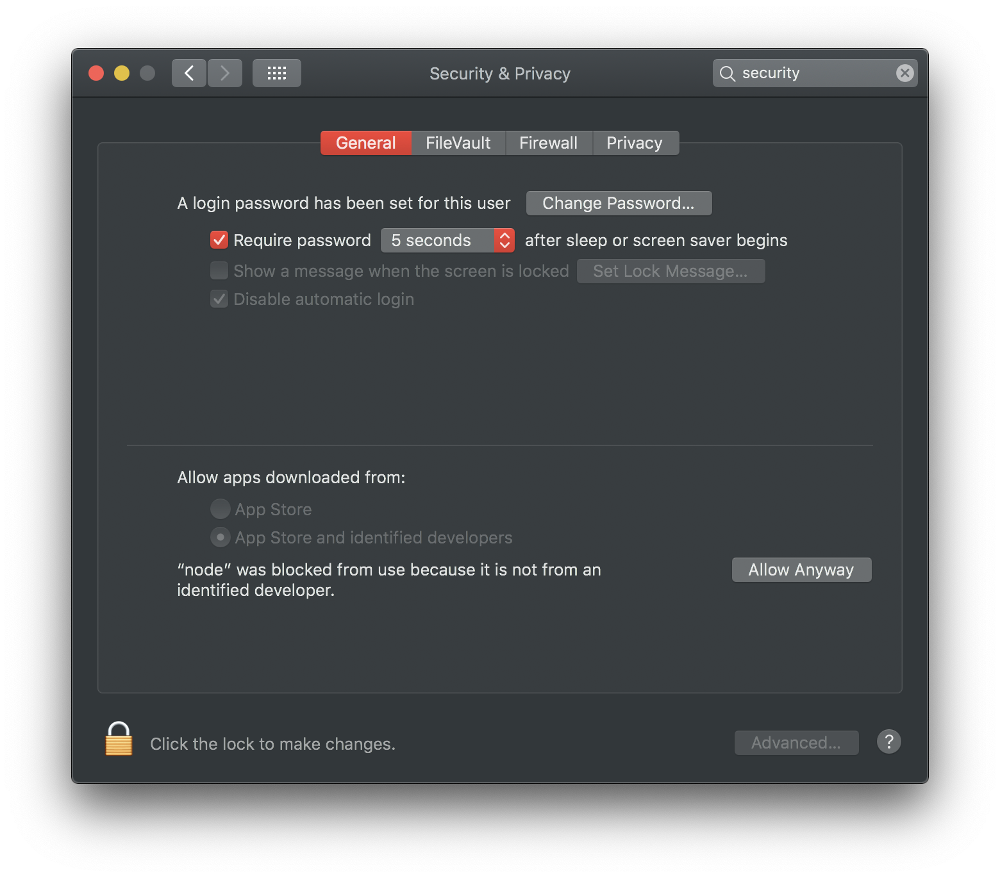
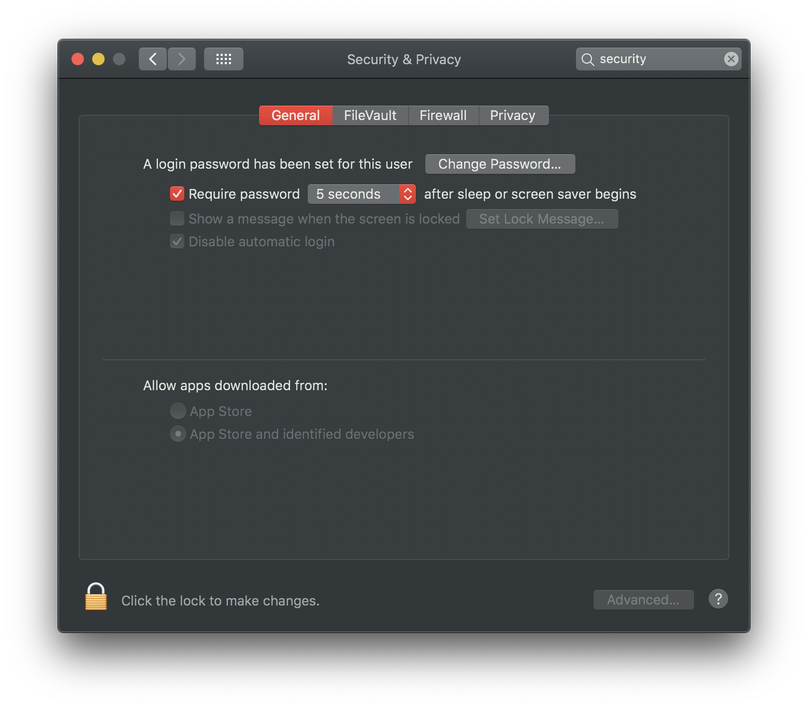
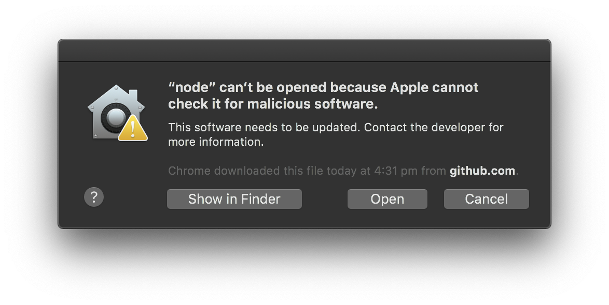
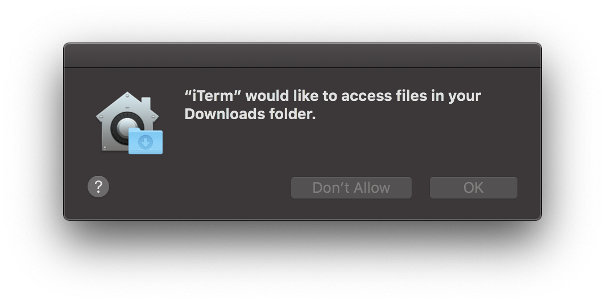

# Meeco CLI

We have created the [Meeco CLI](https://github.com/Meeco/cli) tool that allows you to interact with the different APIs for the comfort of your command line. To get this up and running we have created a tool that sets up a user for you, and creates all the necessary access tokens.

[https://github.com/Meeco/cli](https://github.com/Meeco/cli)

## Installation Instructions

To install the Meeco CLI you'll need to grab the latest version from the releases page [https://github.com/Meeco/cli/releases](https://github.com/Meeco/cli/releases).

We've created versions for Windows, Linux distributions and macOS

### macOS

With newer versions of macOS, the operating system stops you from running unsigned code. In the near future we will sign the code for this repository, but in the mean time, here are the steps to running the Meeco CLI from the command line despite the warning from macOS.

We're using Catalina \(10.15.X\) and `meeco-v0.2.1-darwin-x64.tar.gz` in this example.

* Once you've downloaded the package, unarchive it. This will create a folder `meeco`.
* In your terminal, change directories the newly created `meeco` folder.
* Run `./bin/meeco --version` and note the alert warning that "node" cannot be opened.

* Open macOS System Preferences, find the `Security & Privacy` settings pane, and open the "General" tab.

* Tap the "Allow Anyway" button, which removes the warning about not being able to run Node. 

* In your terminal window, repeat the last command `./bin/meeco --version`. Another alert will appear, though this time you are able to click "Open".

* Depending which terminal app you're using, you may receive another warning about the app trying to access your folder.

* Run `./bin/meeco --version` from your terminal once more, and you should get the following output: `cli/0.2.1 darwin-x64 node-v12.16.1`

You're now ready to use the CLI!

You can now go back to the [Meeco Quickstart](../getting-started/quickstart.md) guide and follow the run-through in order to create a User, setup the Keystore, gain access to the Vault and create your first Item!

### 

